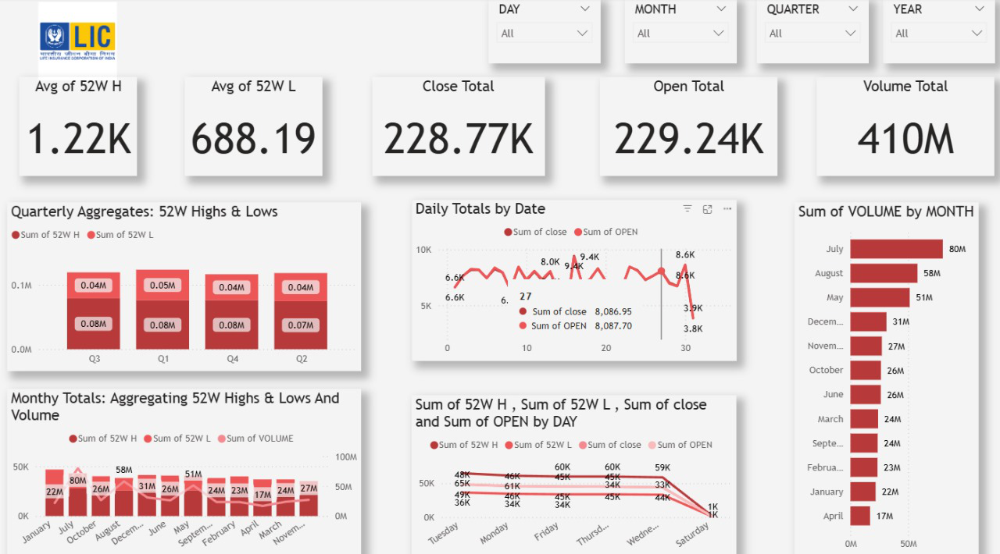

# LIC Stock Market Dashboard 📊

This repository contains a **Power BI dashboard** analyzing the stock performance of **Life Insurance Corporation of India (LIC)**. The dashboard provides insights into 52-week highs & lows, daily open/close trends, and monthly/quarterly trading volumes.  

---

## 🚀 Features
- 52-Week Analysis: Average high and low values of LIC stock  
- Daily Totals: Open vs. Close tracking across the month  
- Quarterly Aggregates: 52-week highs & lows summarized per quarter  
- Monthly Totals: 52-week highs, lows, and traded volume aggregated monthly  
- Volume Analysis: Month-wise trading volume comparison  
- Interactive Filters: Drill-down by day, month, quarter, and year  

---

## 📂 Repository Structure

├── data/ # Raw and processed datasets 
├── pbix/ # Power BI .pbix project file
├── images/ # Dashboard screenshots
│ └── lic_dashboard.png
├── README.md # Project documentation


---

## 🖼️ Dashboard Preview  

  

---

## 🛠️ Tools & Technologies
- Power BI – For visualization and reporting  
- Excel/CSV – Data source  
- GitHub – Version control and project sharing  

---

## 📈 Insights from Dashboard
- Average 52W High: **1.22K**  
- Average 52W Low: **688.19**  
- Total Close: **228.77K**  
- Total Open: **229.24K**  
- Total Volume: **410M**  
- Peak trading volume in **July (80M)**  

---

## 🔧 How to Use
1. Clone this repository:  
   ```bash
   git clone https://github.com/your-username/lic-stock-dashboard.git
